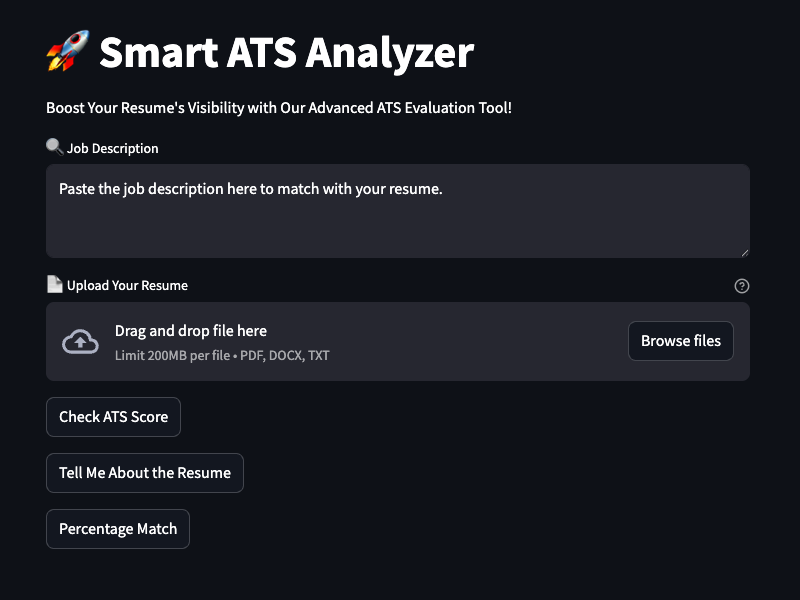

# Resume Application Tracking System (ATS) Setup Guide


## Overview
This guide will walk you through setting up the Resume Application Tracking System (ATS) on your PC. This system leverages the Google Gemini Pro Vision LIM Model to evaluate resumes against job descriptions and generate PDF reports.

## Prerequisites
- Python 3.x and Make installed on your PC
- Basic knowledge of Python and Streamlit
- Google API key for Google Generative Language API model

## Setup Steps

### 1. Clone the Repository
First, clone the repository containing the code for the ATS system.

```bash
git clone <repository-url>
cd <repository-directory>
```

### 2. Create and Activate a Virtual Environment
It's a good practice to use a virtual environment to manage dependencies.

```bash
python -m venv .venv
source .venv/bin/activate  # On Windows use: .venv\Scripts\activate
```

### 3. Install Required Libraries
Install the necessary Python libraries using `pip`.

```bash
pip install -r requirements.txt
```

### 4. Set Up Environment Variables
Create a `.env` file in the project directory to store your Google API key.

```bash
cp sample.env .env
```

Add your Google API key to the `.env` file in the following format:

```
GOOGLE_API_KEY=your_google_api_key_here
```

Optionally, modify the Generative Language API model:

```
GOOGLE_GENAI_MODEL=gemini-1.5-flash-002
```

### 5. Obtain Google API Key
To obtain a Google API key for Google Gemini Pro Vision LIM Model, follow these steps:

1. **Sign In**: Go to the [Google Cloud Console](https://console.cloud.google.com/) and sign in with your Google account.
2. **Create a Project**: Click on the project dropdown and select "New Project." Enter a project name and click "Create."
3. **Enable APIs**: Navigate to "APIs & Services" > "Library." Search for the Google Gemini API and enable it.
4. **Create Credentials**: Go to "APIs & Services" > "Credentials" and click "Create Credentials" > "API Key." Copy the generated API key and paste it into your `.env` file as described above.

### 6. Run the Application
Run the Streamlit application to start the ATS system.

```bash
streamlit run app.py
```

Replace `app.py` with the name of your main Python script if different.

### 7. Access the Application
Open your web browser and go to `http://localhost:8501` to access the ATS application.

### 8. Using the Application
- **Upload Your Resume**: Click on the "📄 Upload Your Resume" button to upload a PDF resume.
- **Enter Job Description**: Paste the job description into the "🔍 Job Description" text area.
- **Submit Evaluation**: Click on "Check ATS Score," "Tell Me About the Resume," or "Percentage Match" to get evaluations based on the provided resume and job description.
- **Download PDF Report**: Once the evaluation is complete, you can download the report in PDF format.

## Troubleshooting
- **Missing Libraries**: Ensure all required libraries are installed. Check the `requirements.txt` file for a list of dependencies.
- **API Key Issues**: Verify that your Google API key is correctly set up in the `.env` file and that it has the necessary permissions.
- **File Upload Errors**: Ensure the file is a valid PDF and properly formatted.

# License 🪪
[This project](https://github.com/stairwaytowonderland/Smart-ATS-Analyzer) © 2025 by [Andrew Haller](https://github.com/andrewhaller) is licensed under the [MIT License](https://opensource.org/license/mit). See the [LICENSE](LICENSE) file for details.
